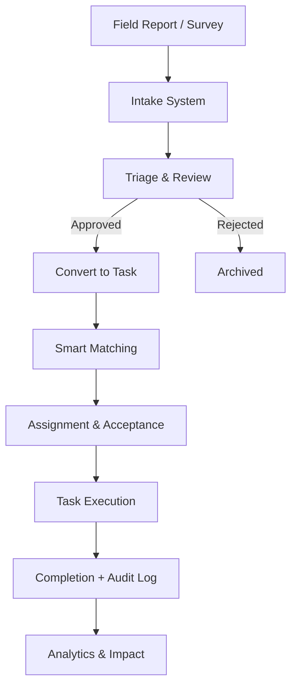

<p align="center">
  
  
  
  
  
  
</p>

<h1 align="center">Namma Connect</h1>

<p align="center">
  <b>Data-Driven Volunteer Coordination System for Hyper-Local Community Impact</b><br/>
  <i>Transforming community reports into verified action through structured NGO workflows.</i>
</p>

<p align="center">
  <a href="https://ngo-app-812651531349.asia-south1.run.app">Live Demo</a> &middot;
  <a href="#api-overview">API Reference</a> &middot;
  <a href="#architecture">Architecture</a> &middot;
  <a href="#deployment">Deployment</a> &middot;
  <a href="#getting-started">Getting Started</a>
</p>

<p align="center">
  
  
  
  
  
  
  
  
  
  
  
</p>

---

## What is Namma Connect?

Namma Connect is a **multi-tenant, workflow-driven NGO coordination platform** purpose-built for Indian community operations. Submit field reports, triage community needs, match volunteers using intelligent scoring, execute missions with GPS-tracked check-in/out, auto-escalate SLA breaches, and track impact across districts — all under strict tenant isolation.

> **Not a task manager. A community action coordination system.**

The platform bridges the gap between field data and coordinated action through three intelligence layers:

1. **Intake Intelligence** — OCR + Gemini NLP classification of survey images with duplicate detection (Jaccard + Haversine)
2. **Matching Engine** — weighted scoring across skills (40%), distance (30%), availability (20%), and reliability (10%)
3. **Escalation System** — time-based auto-escalation with smart reassignment to next-best volunteers

---

## Architecture

```
┌─────────────────────────────────────────────────────────────────────────┐
│                      FRONTEND (React 19 + TypeScript + Vite)            │
│                                                                         │
│  Landing  UnifiedLogin  DashboardOverview  TriageDashboard              │
│  MissionPlanning  VolunteerManagement  VolunteerDashboard               │
│  SurveyUpload  AdminConsole  NGORegister  VolunteerRegister             │
│                                                                         │
│  TanStack Query (server state)  |  React Leaflet (maps)                │
│  Recharts (analytics)  |  React Hook Form + Zod (validation)           │
├─────────────────────────────────────────────────────────────────────────┤
│                      BACKEND (FastAPI + Python 3.11)                    │
│                                                                         │
│  ┌──────────────┐  ┌──────────────┐  ┌──────────────┐                  │
│  │ Intake &     │  │ Smart        │  │ Assignment   │                  │
│  │ Triage       │  │ Matching     │  │ Lifecycle    │                  │
│  └──────────────┘  └──────────────┘  └──────────────┘                  │
│  ┌──────────────┐  ┌──────────────┐  ┌──────────────┐                  │
│  │ OCR + NLP    │  │ Auto         │  │ Batch        │                  │
│  │ Pipeline     │  │ Escalation   │  │ Matching     │                  │
│  └──────────────┘  └──────────────┘  └──────────────┘                  │
│  ┌──────────────┐  ┌──────────────┐  ┌──────────────┐                  │
│  │ Gemini 1.5   │  │ Twilio SMS   │  │ Geocoding    │                  │
│  │ Flash        │  │ Notifications│  │ (Nominatim)  │                  │
│  └──────────────┘  └──────────────┘  └──────────────┘                  │
├─────────────────────────────────────────────────────────────────────────┤
│                      DATA LAYER                                        │
│                                                                         │
│  Supabase (PostgreSQL 15 + Auth + RLS)                                  │
│  Supabase Storage (survey images)                                       │
│  17 Tables with strict ngo_id tenant isolation                          │
└─────────────────────────────────────────────────────────────────────────┘
```

---

## Core Workflow



---

## Features

### Intake & Triage System
- Collect reports via field worker submissions or **OCR-based survey uploads**
- Tesseract OCR with OpenCV preprocessing (deskew, denoise, Otsu thresholding) — supports **Tamil + English**
- **Gemini 1.5 Flash** classifies extracted text into structured task metadata
- Duplicate detection using **Jaccard similarity + Haversine distance**
- Reports go through triage review before conversion to tasks

### Smart Volunteer Matching
- Weighted scoring: **Skills 40%** + Geographic Proximity 30% + Availability 20% + Reliability 10%
- Returns **Top 3** best-suited volunteers with transparent score breakdowns
- Batch matching for multiple tasks in a single operation

### Assignment Lifecycle
- Full workflow: Assigned → Accepted → Check-in (GPS) → Check-out (GPS) → Completed
- Decline, reassign, and escalate paths
- GPS-verified check-in/check-out for field accountability

### Auto-Escalation Engine
- Time-based escalation for unaccepted assignments (2-hour threshold)
- SLA breach detection with automatic reassignment to next-best volunteer
- Ensures **no community need is left unattended**

### Multi-Tenant Architecture
- Strict `ngo_id` scoping on every database query and API endpoint
- Supabase Row-Level Security (RLS) for data isolation
- JWT-based authentication with role-based access control

### SMS Notifications
- Twilio-based notifications for assignment, acceptance, cancellation, and completion
- Background task processing to avoid blocking request flow

### Volunteer Management
- Controlled onboarding: Pending → Approved → Active
- CSV bulk upload with automatic geocoding
- Scheduling system with day-of-week time slots and recurring schedules

### Impact Analytics
- Volunteer-level metrics: hours worked, households served, tasks completed, impact score
- District-level aggregation across all 38 Tamil Nadu districts
- Task templates for recurring community needs

### Audit Trail
- 13 predefined action types covering every state change
- Actor, entity, and description logging
- Filterable by entity type, entity ID, and user ID

### Admin Console
- Platform-wide NGO management (approve/suspend)
- Global statistics and audit log access
- Secret-token-based admin registration

---

## Tech Stack

| Layer | Technologies |
|---|---|
| **Frontend** | React 19, TypeScript 6, Vite 8, React Router v7, Tailwind CSS v4, TanStack Query, React Hook Form, Zod, Recharts, React Leaflet, Axios, react-hot-toast |
| **Backend** | FastAPI, Uvicorn, Pydantic v2, Python 3.11 |
| **AI / OCR** | Google Gemini 1.5 Flash (NLP classification), Tesseract OCR, OpenCV (image preprocessing) |
| **Database** | Supabase (PostgreSQL 15 + Auth + RLS + Storage) |
| **Auth** | Supabase Auth, PyJWT (ES256/HS256) |
| **Notifications** | Twilio SMS |
| **Geocoding** | Nominatim OpenStreetMap API |
| **Deployment** | GCP Cloud Run, Firebase Hosting, Docker, Cloud Build |
| **Testing** | E2E smoke tests (requests) |

---

## Project Structure

```
smart-resource-allocation/
├── frontend/                         # React + TypeScript SPA
│   ├── src/
│   │   ├── pages/                    # 14 page components
│   │   ├── components/               # 8 reusable UI components
│   │   ├── context/                  # Role-based config provider
│   │   ├── hooks/                    # Custom hooks (useAuth)
│   │   ├── layouts/                  # MainLayout with role-aware sidebar
│   │   ├── services/                 # 11 API service modules (Axios)
│   │   ├── types/                    # TypeScript interfaces (332 lines)
│   │   ├── utils/                    # Constants, notifications, 38 district coords
│   │   └── routes/                   # Route definitions
│   ├── firebase.json                 # Firebase Hosting config
│   ├── vercel.json                   # Vercel deployment config
│   └── package.json
│
├── backend/                          # FastAPI + Python backend
│   ├── app/
│   │   ├── main.py                   # App factory, router registration, static serving
│   │   ├── routes/                   # 11 routers, 48 API endpoints
│   │   ├── services/                 # 7 service modules (matching, OCR, NLP, escalation, etc.)
│   │   ├── models/                   # Pydantic models (intake, task, volunteer)
│   │   ├── db/                       # Supabase client, JWT auth, RBAC
│   │   └── utils/                    # Audit logging, error handling
│   ├── requirements.txt              # 15 Python dependencies
│   ├── Dockerfile                    # Backend-only container
│   ├── seed_data.py                  # Dev seed (3 cities, 60 volunteers, 15 tasks)
│   └── .env.example                  # Environment variable template
│
├── tests/                            # E2E smoke tests (11 test functions)
├── Dockerfile                        # Unified multi-stage build
├── cloudbuild.yaml                   # GCP Cloud Build CI/CD
├── render.yaml                       # Render deployment blueprint (legacy)
├── DEPLOYMENT.md                     # Multi-platform deployment guide
└── README.md
```

---

## API Overview

**48 endpoints** across 11 routers.

| Router | Prefix | Endpoints | Purpose |
|---|---|---|---|
| Auth | `/api/auth` | 5 | NGO, Field Worker registration & login |
| Admin | `/api/admin` | 5 | Super Admin management, NGO approval |
| Intake Reports | `/api/intake-reports` | 5 | Report CRUD, triage, duplicate detection |
| Volunteers | `/api/volunteers` | 10 | Registration, bulk upload, status lifecycle |
| Tasks | `/api/tasks` | 10 | CRUD, matching, assignment, escalation, dashboard |
| Assignments | `/api/assignments` | 10 | Accept/decline, check-in/out, SLA monitoring |
| Scheduling | `/api/scheduling` | 5 | Volunteer time slot management |
| Analytics | `/api/analytics` | 6 | Impact metrics, task templates |
| Audit | `/api/audit-logs` | 2 | Audit trail with entity filtering |
| Batch Matching | `/api/batch-matching` | 5 | Multi-task volunteer matching |
| OCR | `/api/ocr` | 1 | Survey image scanning |

---

## Database Schema

**17 tables** in Supabase (PostgreSQL 15) with strict `ngo_id` tenant isolation:

| Table | Purpose |
|---|---|
| `ngos` | Organization profiles with approval status |
| `volunteers` | Volunteer profiles with skills, location, and performance tracking |
| `tasks` | Community needs with urgency scoring and status lifecycle |
| `assignments` | Task-volunteer pairings with GPS check-in/out and SLA tracking |
| `intake_reports` | Field reports with duplicate detection and triage workflow |
| `field_workers` | Field worker profiles with phone+PIN authentication |
| `activity_log` | Real-time activity feed entries |
| `audit_logs` | Comprehensive audit trail (13 action types) |
| `scheduling_slots` | Volunteer availability by day and time |
| `volunteer_impact_metrics` | Per-volunteer impact aggregation |
| `district_impact_metrics` | Per-district impact aggregation |
| `task_templates` | Reusable task configurations |
| `batch_match_suggestions` | Stored matching suggestions for review |
| `batch_assignments` | Batch operation history |
| `survey_uploads` | OCR upload metadata |
| `users` | User account references |

**Storage Bucket:** `survey-images` (Supabase Storage)

---

## Environment Variables

### Backend (`backend/.env`)

| Variable | Required | Description |
|---|---|---|
| `SUPABASE_URL` | Yes | Supabase project URL |
| `SUPABASE_KEY` | Yes | Supabase anon/service key |
| `SUPABASE_JWT_SECRET` | Yes | JWT secret for auth verification |
| `GEMINI_API_KEY` | Yes | Google Gemini API key |
| `TWILIO_SID` | No | Twilio account SID |
| `TWILIO_TOKEN` | No | Twilio auth token |
| `TWILIO_FROM` | No | Twilio sender phone (E.164 format) |
| `ALLOW_DEV_SEED` | No | Enable dev seed script (`true`/`1`/`yes`) |
| `ADMIN_REGISTRATION_TOKEN` | No | Secret token for admin registration |

### Frontend (`frontend/.env`)

| Variable | Required | Description |
|---|---|---|
| `VITE_API_URL` | Yes | Backend API base URL |

---

## Getting Started

### Prerequisites

- **Python 3.11+** and **Node.js 20+**
- **Supabase** project ([free tier](https://supabase.com/))
- **Gemini API Key** ([Google AI Studio](https://aistudio.google.com/))
- **Tesseract OCR** installed on your system
- **Twilio** account (optional — for SMS notifications)

### 1. Clone

```bash
git clone https://github.com/Ganesh-0509/smart-resource-allocation.git
cd smart-resource-allocation
```

### 2. Backend

```bash
cd backend
python -m venv venv
venv\Scripts\activate        # Windows
# source venv/bin/activate   # macOS/Linux

pip install -r requirements.txt
```

Create `backend/.env`:
```env
SUPABASE_URL=https://your-project.supabase.co
SUPABASE_KEY=your-service-role-key
SUPABASE_JWT_SECRET=your-jwt-secret
GEMINI_API_KEY=your-gemini-key
```

Start the API:
```bash
uvicorn app.main:app --reload --port 8000
```

### 3. Frontend

```bash
cd frontend
npm install
```

Create `frontend/.env`:
```env
VITE_API_URL=http://localhost:8000
```

Start dev server:
```bash
npm run dev
```

Open **http://localhost:5173** — you're live.

### 4. Seed Development Data

```bash
# Windows
$env:ALLOW_DEV_SEED="true"
python seed_data.py

# macOS/Linux
ALLOW_DEV_SEED=true python seed_data.py
```

Seeds 3 cities, 60 volunteers, and 15 tasks for testing.

### 5. Docker (Alternative)

```bash
docker-compose up --build
```

- Frontend + Backend: http://localhost:8080
- Swagger docs: http://localhost:8080/docs

---

## Deployment

### Google Cloud Run (Primary)

1. Push to GitHub
2. Cloud Build triggers automatically via `cloudbuild.yaml`
3. Multi-stage Docker build: frontend compiled → backend serves static + API
4. Deploys to `asia-south1` region

### Firebase Hosting (Frontend Only)

```bash
cd frontend
npm run build
firebase deploy
```

### Render (Legacy)

1. Push to GitHub
2. Render Dashboard → **New Blueprint** → Connect repo
3. Set environment variables in Render dashboard

### CI/CD

GCP Cloud Build pipeline (`cloudbuild.yaml`):
- Builds unified Docker image
- Deploys to Cloud Run service `ngo-app`

---

## Demo Flow

1. **Register** an NGO at `/ngo/register`
2. **Submit** a field report at `/field/report`
3. **Review** the report in the Triage Dashboard at `/ngo/triage`
4. **Approve** and convert it into a task
5. **Match** and deploy the top-ranked volunteer in the Missions board
6. **Complete** the task as a volunteer and view the **Audit Trail** for transparency

---

## Testing

```bash
cd tests
python e2e_test.py
```

**11 smoke tests** covering: health check, volunteer CRUD, task CRUD, assignment creation, analytics, batch matching, scheduling, and OCR queue.

---

## License

MIT License. See [LICENSE](LICENSE) for details.

---

<p align="center">
  <b>Namma Connect — From Reports to Ready Action.</b><br/>
  Built for <b>real-world impact</b> with care by Ganesh Kumar T
</p>
