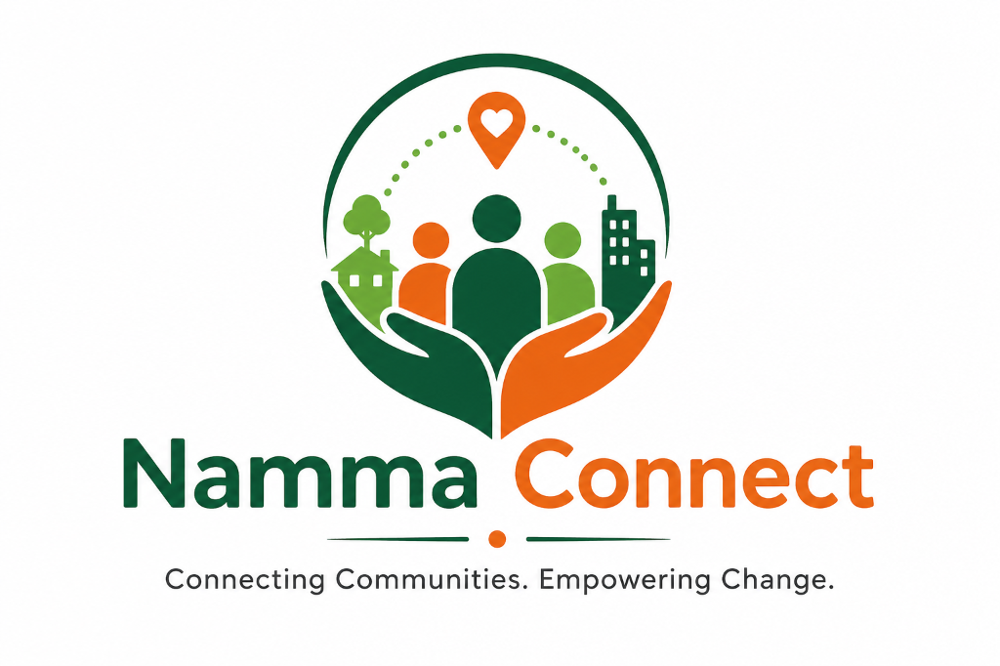
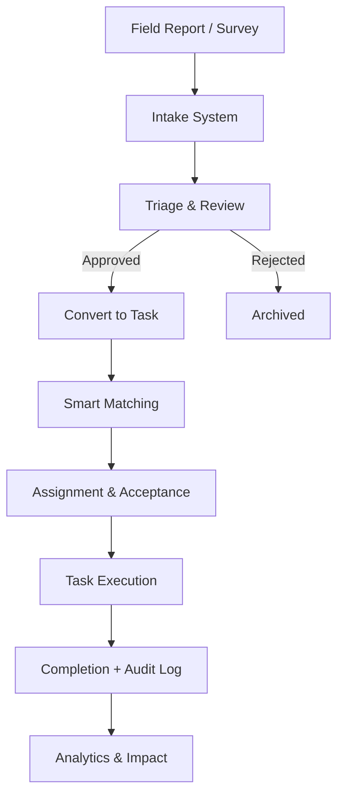

# <p align="center"></p>

<p align="center">
  <b>Data-Driven Volunteer Coordination System for Hyper-Local Community Impact.</b><br/>
  <i>Transforming community reports into verified action through structured NGO workflows.</i>
</p>

<p align="center">
  
  
  
</p>

---

## 🌿 The Vision

In real-world NGO operations, the biggest challenge is not collecting data — it is **turning scattered community needs into coordinated action**.

**Namma Connect** is a **multi-tenant, workflow-driven NGO coordination platform** that bridges the gap between:

> 📥 Field Reports → 🧠 Decision Making → 🤝 Volunteer Action

The system ensures that:
- Raw community data is **validated before action**
- Tasks are **prioritized and assigned intelligently**
- Volunteers are **matched based on real-world constraints**

---

## 🔄 Core Workflow (Real NGO Model)

This platform is designed around a **realistic NGO operational pipeline**:



---

## ✨ Core Features

### 🧾 Intake & Triage System
- Collect reports via field worker submissions or OCR-based survey uploads.
- Reports are **reviewed before becoming tasks** to ensure data quality.
- Full status tracking from *Pending* to *Converted*.

### 🧠 Smart Volunteer Matching
- Intelligent scoring based on **Skills (40%)**, **Distance (30%)**, **Availability (20%)**, and **Reliability (10%)**.
- Returns the **Top 3** best-suited volunteers for any mission.
- Explains matching logic via transparent score breakdowns.

### 🙋 Volunteer Lifecycle Management
- Controlled onboarding workflow: *Pending → Approved → Active*.
- Only verified and active volunteers participate in mission matching.
- Tracks performance, completion rates, and historical impact.

### 🚨 Escalation & Reliability System
- Automatically handles task non-acceptance via time-based escalation.
- Triggers smart reassignment to the next best candidate if SLAs are breached.
- Ensures **no community need is left unattended**.

### 🏢 Multi-Tenant Architecture
- Strict data isolation using `ngo_id` at the database and API level.
- Each NGO operates in its own secure workspace (Reports, Tasks, Volunteers, Analytics).
- Secure JWT-based authentication with role-based access control.

---

## 🛠️ Tech Stack

### **Frontend (React + Vite)**
- **UI:** Custom "Forest & Clay" design system with Tailwind CSS.
- **State:** TanStack Query for optimized data fetching and real-time UI updates.
- **Navigation:** Role-aware sidebar layout for NGO, Volunteer, and Field personas.

### **Backend (FastAPI)**
- **API:** Asynchronous Python with FastAPI and proper JWT verification.
- **Service Layer:** Modular architecture for Matching, OCR, and Audit logging.
- **Database:** Supabase (PostgreSQL) with strict tenant-scoping logic.

---

## 🚀 Getting Started

### 1. Clone & Install
```bash
git clone https://github.com/Ganesh-0509/smart-resource-allocation.git
cd smart-resource-allocation

pip install -r backend/requirements.txt
cd frontend && npm install
```

### 2. Seed Development Data
```powershell
$env:ALLOW_DEV_SEED="true"
python backend/seed_data.py
```

### 3. Run the Application
**Backend:**
```bash
uvicorn app.main:app --reload
```
**Frontend:**
```bash
npm run dev
```

---

## 🧪 Demo Flow (Recommended)

1.  **Submit** a field report at `/field/report`.
2.  **Review** the report in the NGO Triage Dashboard at `/ngo/triage`.
3.  **Approve** and convert it into a task.
4.  **Match** and deploy the top-ranked volunteer in the Missions board.
5.  **Complete** the task as a volunteer and view the **Audit Trail** for transparency.

---

## 📜 License
Distributed under the MIT License. See `LICENSE` for details.

<p align="center"> Built for <b>real-world impact</b> 🌍 with ❤️ by Ganesh Kumar T </p>
